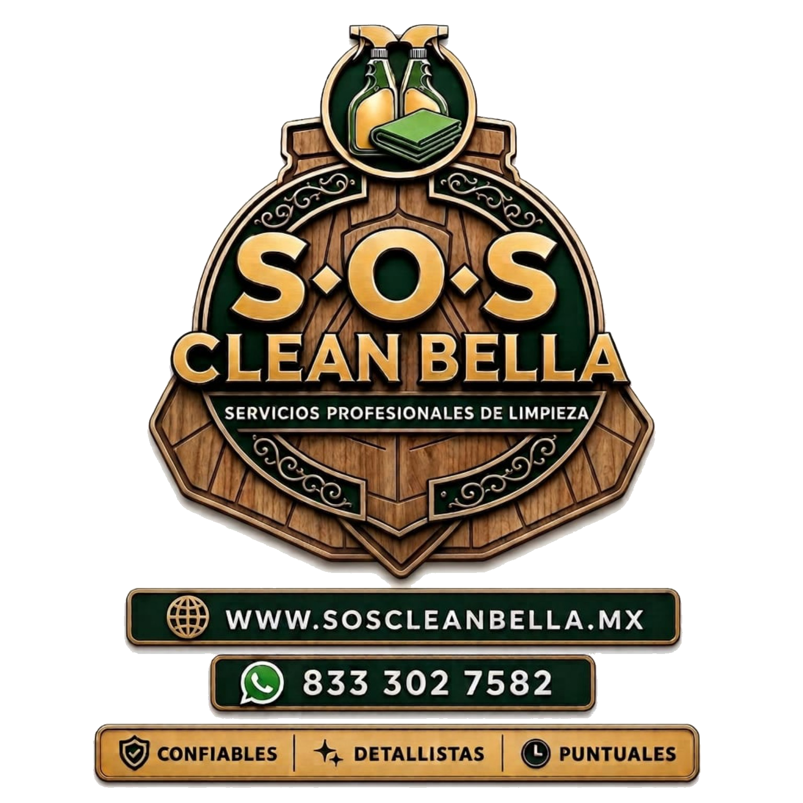

<div align="center">
  

  # CleanBella
  **Servicios Profesionales de Limpieza en Tampico, Tamaulipas**

  *Tu espacio impecable. La tranquilidad de dejarlo en nuestras manos.*

  [](https://react.dev/)
  [](https://www.typescriptlang.org/)
  [](https://vitejs.dev/)
  [](https://tailwindcss.com/)
  [](https://motion.dev/)

  <br />

  <a href="#-servicios">Servicios</a> •
  <a href="#-stack-tecnológico">Tecnologías</a> •
  <a href="#-desarrollo-local">Instalación</a> •
  <a href="#-estructura-del-proyecto">Estructura</a> •
  <a href="#-contacto">Contacto</a>
</div>

---

## 🌿 Sobre CleanBella

**CleanBella** es una empresa de servicios profesionales de limpieza ubicada en la zona metropolitana de **Tampico, Ciudad Madero y Altamira, Tamaulipas**. Este sitio web representa la identidad digital premium de la marca, diseñada con una estética sofisticada (Verde Bosque, Acentos Dorados y Crema Suave) orientada a la conversión y la confianza del cliente.

### Nuestros Valores de Marca
- **🛡️ Confiables**: Personal verificado, capacitado y comprometido con la seguridad de tu hogar o empresa.
- **✨ Detallistas**: Cuidamos lo que otros pasan por alto, perfeccionando cada rincón.
- **⏱️ Puntuales**: Respetamos tu tiempo; cumplimiento estricto de horarios acordados.

---

## 🧹 Servicios

El sitio presenta el catálogo integral de soluciones de limpieza:

1. **Limpieza Residencial**: Cuidado continuo para mantener el hogar como un refugio ordenado e impecable.
2. **Limpieza Profunda**: Limpieza minuciosa en rincones, zoclos, ventanas y áreas de difícil acceso.
3. **Limpieza de Oficinas**: Entornos corporativos relucientes para fomentar productividad y bienestar.
4. **Limpieza Comercial**: Espacios de atención al público con el más alto estándar de higiene.
5. **Limpieza para Airbnb**: Turnarounds ágiles y exhaustivos para garantizar calificaciones de 5 estrellas de tus huéspedes.
6. **Después de Eventos**: Restauración total del orden post-fiestas y reuniones.

---

## 💻 Stack Tecnológico

- **Frontend Core**: [React 19](https://react.dev/) + [TypeScript](https://www.typescriptlang.org/)
- **Empaquetador & Dev Server**: [Vite 6](https://vitejs.dev/)
- **Estilos**: [Tailwind CSS v4](https://tailwindcss.com/) con tema personalizado (`brand-forest`, `brand-gold`, `brand-cream`, `brand-charcoal`)
- **Animaciones**: [Motion](https://motion.dev/) (`motion/react`) para transiciones fluidas y micro-interacciones
- **Iconografía**: [Lucide React](https://lucide.dev/)
- **Fuentes**: Playfair Display (Serif de lujo) & Manrope (Sans-serif moderno y legible)

---

## 🚀 Desarrollo Local

### Prerrequisitos
- [Node.js](https://nodejs.org/) (versión 20 o superior recomendada)
- Gestor de paquetes: `pnpm` (recomendado) o `npm`

### 1. Clonar e instalar dependencias

```bash
# Con pnpm
pnpm install

# O con npm
npm install
```

### 2. Iniciar el servidor de desarrollo

```bash
pnpm dev
# El servidor estará disponible en http://localhost:3000
```

### 3. Scripts disponibles

| Comando | Descripción |
| --- | --- |
| `pnpm dev` | Inicia el servidor de desarrollo con Vite en `http://localhost:3000` |
| `pnpm build` | Compila la aplicación para producción en la carpeta `dist/` |
| `pnpm preview` | Previsualiza localmente el build de producción |
| `pnpm lint` | Ejecuta verificación de tipos con `tsc --noEmit` |

---

## 📁 Estructura del Proyecto

```text
cleanbella/
├── public/
│   ├── assets/
│   │   ├── CleanBellaLogo.png            # Logotipo principal con fondo transparente
│   │   ├── CleanBellaLogoEmblem.png      # Emblema / Escudo recortado
│   │   └── CleanBellaLogoExtended.png    # Logotipo extendido con gráficos de limpieza
│   ├── favicon.ico                       # Favicon del sitio
│   └── favicon.png                       # Favicon en PNG
├── src/
│   ├── components/
│   │   ├── Navbar.tsx                    # Navegación fija con efecto glassmorphism al scroll
│   │   ├── Hero.tsx                      # Sección principal con llamada a la acción e imagen
│   │   ├── TrustBar.tsx                  # Barra de garantías y diferenciales
│   │   ├── Services.tsx                  # Tarjetas interactivas de catálogo de servicios
│   │   ├── WhyUs.tsx                     # Sección "Por qué elegirnos" con logotipo extendido
│   │   ├── Process.tsx                   # Proceso simple en 3 pasos para agendar
│   │   ├── LocalSection.tsx              # Cobertura local (Tampico, Madero, Altamira)
│   │   ├── Testimonials.tsx              # Reseñas y opiniones de clientes
│   │   ├── FAQ.tsx                       # Acordeón de preguntas frecuentes
│   │   ├── ContactForm.tsx               # Formulario de solicitud de presupuesto
│   │   ├── BookingCalendar.tsx           # Integración para agendar llamadas
│   │   ├── Footer.tsx                    # Pie de página con enlaces y datos de contacto
│   │   └── WhatsAppFloating.tsx          # Botón flotante para contacto directo por WhatsApp
│   ├── config/
│   │   └── site.ts                       # Configuración centralizada (datos, teléfonos, logos)
│   ├── App.tsx                           # Ensamble de secciones principales
│   ├── index.css                         # Tokens de color, tipografía y estilos base
│   └── main.tsx                          # Punto de entrada de la aplicación
├── index.html                            # Metadatos SEO, Open Graph y enlaces a fuentes
├── package.json
├── tsconfig.json
└── vite.config.ts
```

---

## 📍 Contacto & Ubicación

- **Ubicación**: Tampico, Tamaulipas, México
- **WhatsApp**: [+52 833 302 7582](https://wa.me/528333027582)
- **Correo**: [hola@soscleanbella.mx](mailto:hola@soscleanbella.mx)
- **Sitio Web**: [soscleanbella.mx](https://soscleanbella.mx)

---

<div align="center">
  <sub>© CleanBella. Todos los derechos reservados.</sub>
</div>
